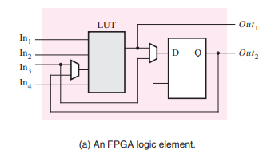

# A tecnologia FPGA

## O que é um FPGA?
O Field-Programmable Gate Array (FPGA) é um tipo especial de circuito integrado que pode ser configurado pelo usuário após a fabricação. Essa característica faz dele uma ferramenta versátil e poderosa no design de sistemas digitais. Diferentemente de circuitos integrados de aplicação específica (ASICs), cuja funcionalidade é fixa após a fabricação, os FPGAs permitem uma reprogramação dinâmica, adaptando-se a novas funcionalidades sem a necessidade de um novo hardware.

## Arquitetura de um FPGA

A estrutura básica de um FPGA é composta por três elementos principais:

### Blocos Lógicos Configuráveis (CLBs):
  Esses blocos são responsáveis pela implementação de funções lógicas. Cada CLB pode ser programado para operar como diferentes tipos de portas lógicas (AND, OR, XOR, etc.) ou combinações mais complexas. Internamente, os CLBs possuem:

  #### Look-Up Tables (LUTs): 
  Memórias pequenas que implementam funções lógicas tabeladas.
  #### Flip-Flops: 
  Elementos de memória que armazenam o estado das operações.

  #### Uma imagem de um elemento lógico de uma placa FPGA:
  
  
  ##### Veja que ele possui um LUT, um Flip-Flop e dois multiplexadores.
### Interconexões Programáveis:
  Redes de conexão que interligam os CLBs, permitindo a configuração de caminhos personalizados para o fluxo de dados. Essas interconexões oferecem alta flexibilidade e podem ser ajustadas para criar circuitos otimizados para diferentes aplicações.

### Blocos de Entrada e Saída (I/O Blocks):
  Estruturas que permitem que o FPGA interaja com o mundo externo, conectando-se a sensores, atuadores ou outros sistemas digitais. Esses blocos são configuráveis para suportar  diferentes padrões de comunicação.

Além desses componentes principais, FPGAs modernos frequentemente incluem recursos adicionais, como blocos de memória dedicados, multiplicadores, processadores embarcados e interfaces de comunicação de alta velocidade.

### Uma imagem da estrutura geral de uma placa FPGA

Aqui, observamos a integração entre os I/O Blocks, as Interconexões e os CLBs

## Funcionamento e Desenvolvimento
O processo de desenvolvimento para FPGAs utiliza linguagens de descrição de hardware (HDLs), como VHDL ou Verilog. A lógica desejada é descrita em nível de comportamento ou estrutural, traduzida para uma representação lógica e então configurada no FPGA através de um fluxo de ferramentas de síntese e mapeamento.

Uma das principais vantagens dos FPGAs é a sua capacidade de paralelização massiva, uma vez que diferentes partes do circuito podem operar simultaneamente, em contraste com as CPUs, que são majoritariamente sequenciais.

## Conclusão
Os FPGAs são pilares fundamentais na lógica digital moderna, fornecendo uma plataforma robusta para projetos que variam desde o ensino básico até aplicações industriais avançadas. 

# Exercício
Explique qual elemento dentro de um CLB da FPGA é responsável por implementar funções lógicas, e por que ele elimina a necessidade de se usar diretamente portas lógicas como AND e OR.

  
Mostrar Resposta

**Elemento responsável:**  
As LUTs (Look-Up Tables) são os elementos responsáveis por implementar funções lógicas em FPGAs.

**Explicação:**  
As LUTs funcionam como tabelas pré-configuradas que armazenam os resultados de funções lógicas para todas as combinações possíveis das entradas. Isso elimina a necessidade de implementar diretamente portas lógicas individuais (como AND ou OR), porque qualquer função lógica pode ser representada pela configuração apropriada da LUT.

Por exemplo, uma LUT de 4 entradas pode implementar qualquer função lógica de 4 variáveis ao simplesmente configurar seus valores de saída para cada combinação de entrada.

  
:::info Contatos
Lucas Mello Ciosaki (14591305) - lucas.ciosaki@usp.br
Artur Domitti Camargo (15441661) - arturdomitti@usp.br
Lucas Alves da Silva (11819553) - lucas.silva2002@usp.br
:::
